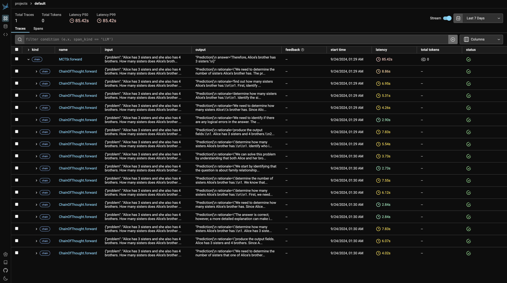

<div align="center">

# 🌐 mcts-llm

<p>
  <a href="https://www.python.org/downloads/release/python-3127/"></a>
  <a href="https://github.com/stanfordnlp/dspy/releases/tag/2.4.17"></a>
  <a href="https://codecov.io/github/NumberChiffre/mcts-llm"></a>
  <a href="https://black.readthedocs.io/en/stable/"></a>
  <a href="https://github.com/numberchiffre/mcts-llm/stargazers"></a>
</p>

**MCTS + LLM + Prompt Engineering => Enhanced LLM Reponse Quality** 🌲📝✨

</div>
<br>

## 🌟 Overview

**mcts-llm** is a lightweight repo that integrates Monte Carlo Tree Search (MCTS) with prompt engineering techniques to enhance the performance of Large Language Models (LLMs). The idea is that scaling up during inference for better LLM reponse quality could become very valuable versus spending more on compute during training. This can extend beyond math problems such as reasoning, knowledge extraction. This repo can fine-tune prompt instructions and benchmark the performance of various MCTS adaptations for prompt engineering.

<br>

## 🚀 Key Features

- **DSPy Compatibility**: Seamless integration with the DSPy framework for prompt engineering with LLMs.
- **LLM Tracing**: Compatible with Arize AI's Phoenix for visualizing search trees.

<br>


## 🛠️ Installation
### Environment variables
Create a `.env` file with the following variables:
```
OPENAI_API_KEY=<your-openai-api-key>
DEEPSEEK_API_KEY=<your-ollama-api-key>
DEEPSEED_BASE_URL=<your-deepseed-base-url>
ARIZE_PHOENIX_PORT=6006
ARIZE_PHOENIX_ENDPOINT=http://phoenix:6006/v1/traces
OLLAMA_BASE_URL=http://host.docker.internal:11434
```

### Docker
```shell
make build
```
<br>

## 🚀 Run
### Quickstart
```python
import dspy
from mcts_llm.mctsr import MCTSr

ollama = dspy.OllamaLocal(
    model="qwen2.5:7b-instruct",
    model_type="chat",
    temperature=1.0,
    max_tokens=1024,
    num_ctx=1024,
    timeout_s=600
)
dspy.settings.configure(lm=ollama, experimental=True)
mctsr = MCTSr()
mctsr_answer = mctsr(problem).answer
print(f"MCStr answer: {mctsr_answer}")
```

<br>

### Demo
```shell
make debug
python examples/demo.py
```
Full LLM trace visualization with Phoenix can be viewed [here](http://localhost:6006/).



<br>

## 📊 Preliminary Results

Initial experiments conducted using `qwen2.5:7B-Instruct` with the following settings:
****
- **Temperature**: 1.0
- **Model Type**: Chat
- **Max Tokens**: 1024
- **Context Length**: 1024
- **Dataset**: Shuffled GSM8K (20 examples)
- **Prompts**: Standard, non-optimized instructions
- **Hardware**: M3 Mac Pro (12 threads)

Default hyperparameters:
- **c**: sqrt(2)
- **initialization**: "I don't know."
- **eps**: 1e-8
- **reward_ub**: 95
- **reward_penalty**: 50
- **default_uct_score**: 1000

| Method               | Accuracy      | Total Time    | Avg Time per Example | Additional Parameters                                                                                                                          |
|----------------------|---------------|---------------|----------------------|------------------------------------------------------------------------------------------------------------------------------------------------|
| Zero-shot CoT        | 13 / 20 (65%) | 2m 01s         | 6.09s                | N/A                                                                                                                                            |
| One-Turn Self-Refine | 15 / 20 (75%) | 7m 45s        | 23.75s               | N/A                                                                                                                                            |
| **MCTSr**            | 16 / 20 (80%) | 43m 03s       | 129.18s              | • max_rollouts = 4<br>• policy = "greedy"<br>• samples_per_node = 3                                     |
| **MCTSr**            | 17 / 20 (85%) | 44m 09s       | 132.50s              | • max_rollouts = 4<br>• policy = "importance_sampling"<br>• samples_per_node = 3                        |
| **MCTSr**            | 16 / 20 (80%) | 51m 10s       | 153.51s              | • max_rollouts = 4<br>• policy = "importance_sampling"<br>• samples_per_node = 4                        |
| **MCTSr**            | 18 / 20 (90%) | 51m 42s       | 153.13s              | • max_rollouts = 4<br>• policy = "greedy"<br>• samples_per_node = 4                                     |
| **MCTSr**            | 15 / 20 (75%) | 1h 38m 53s    | 296.68s              | • max_rollouts = 8<br>• policy = "greedy"<br>• samples_per_node = 4                                     |
| **MCTSr**            | 14 / 20 (70%) | 1h 39m 03s    | 298.40s              | • max_rollouts = 8<br>• policy = "importance_sampling"<br>• samples_per_node = 4                        |

*Note: These results are preliminary and obtained under specific conditions. Further experimentation is needed to generalize the findings.*

<br>

## Paper Implementations

- [Accessing GPT-4 level Mathematical Olympiad Solutions via Monte Carlo Tree Self-refine with LLaMa-3 8B](https://arxiv.org/abs/2406.07394)
- More to come!

<br>

## 🚀 TODOs
- Upgrade DSPy to >= 2.5.0.
- Include datasets for evaluation such as MATH, AIME, Math Odyssey.
- Fine-Tune optimal hyperparameters for MCTSr.
- Fine-Tune with Llama3.1-8B.
- Fine-Tune with Qwen2.5-7B.
- Fine-Tune with DeepSeek-Chat as the prompting model and smaller LLMs with Ollama as the task model.

<br>


## ⚠️ Disclaimer
Please be aware of potential costs when using OpenAI/Anthropic LLMs, especially with larger rollouts. Familiarize yourself with DSPy and its optimizers before extensive use.

<br>

## 📄 License
This project is licensed under the MIT License - see the LICENSE file for details.
